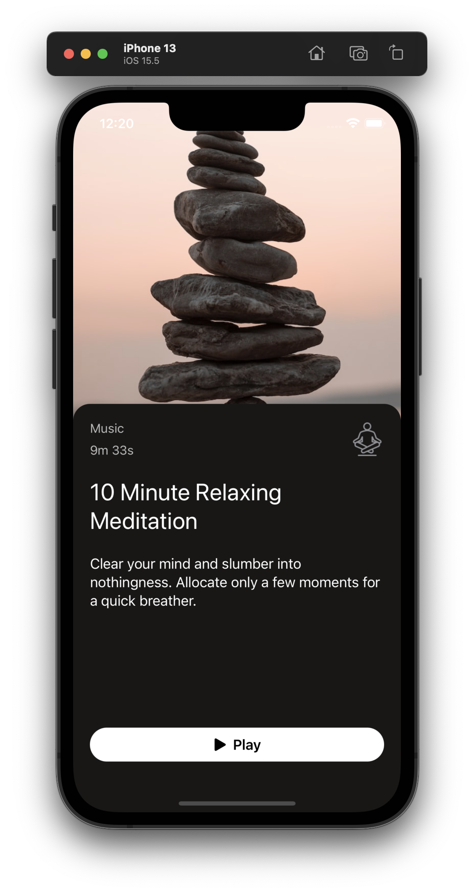
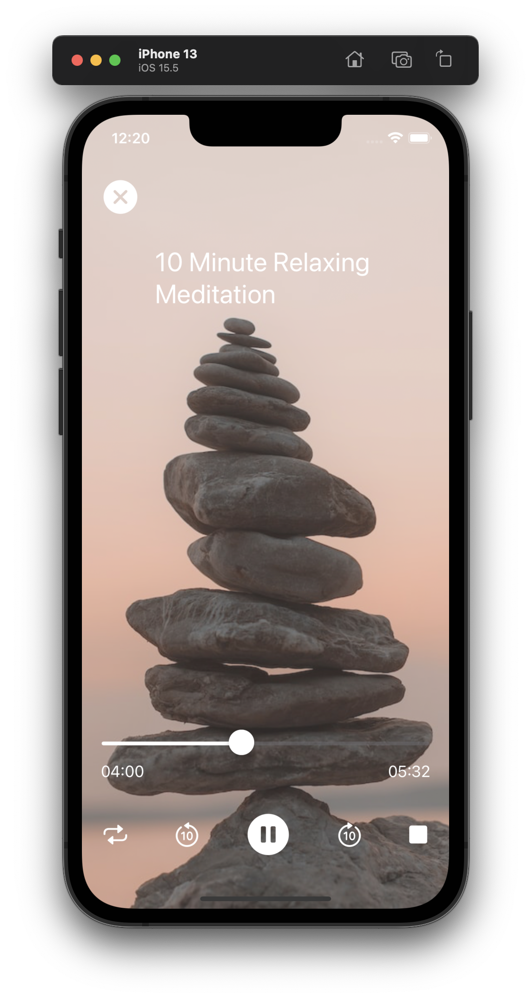

# MeditationApp

#### Meditation App builded with SwiftUI

###### This Meditation App could be a music player app too, the concept is the same. We enabling audio playing with `AVAudioPlayer` from `AVKit` and use Combine and `MVVM` design pattern to connect programming logic and data to the views.

---

#### App Demo.
<table>
  <tr>
    <td>Main Screen</td>
	<td>AudioPlayer Screen</td>
  </tr>
  <tr>
    <td></td>
	<td></td>
  </tr>
</table>

https://user-images.githubusercontent.com/34775704/189526204-5d14e897-47cc-4358-b0b3-45e6e88043a1.mp4

---

Source of the project: [Design Code](https://www.youtube.com/watch?v=_lIhoJ0KwCc)
